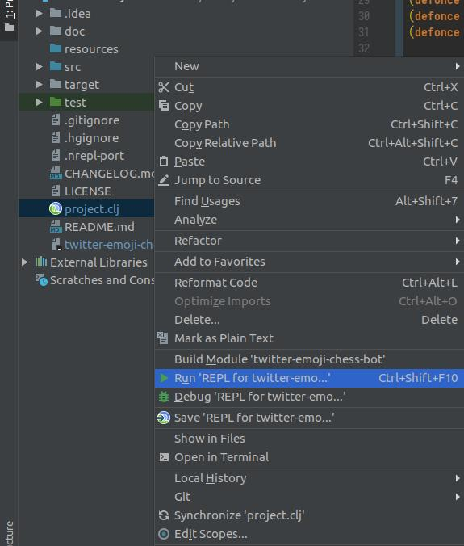
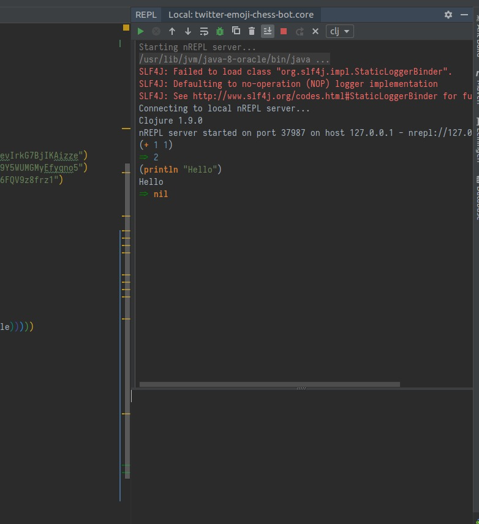
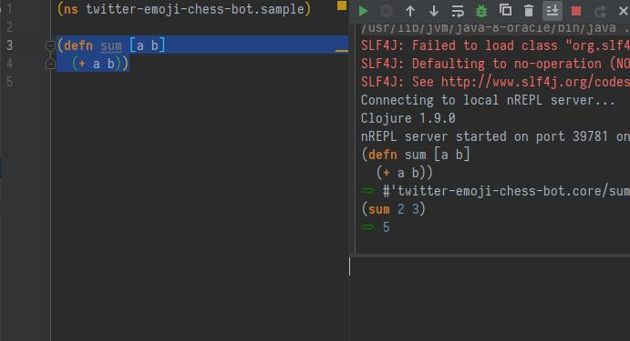
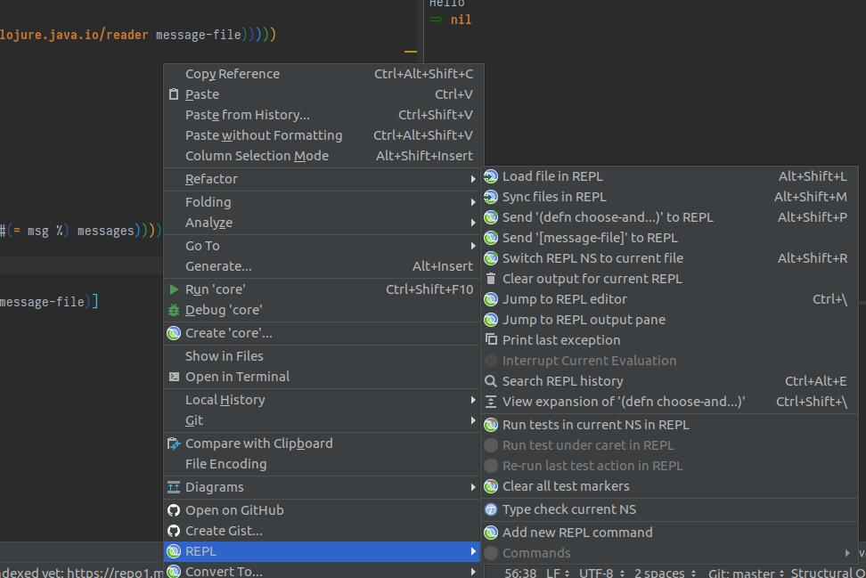
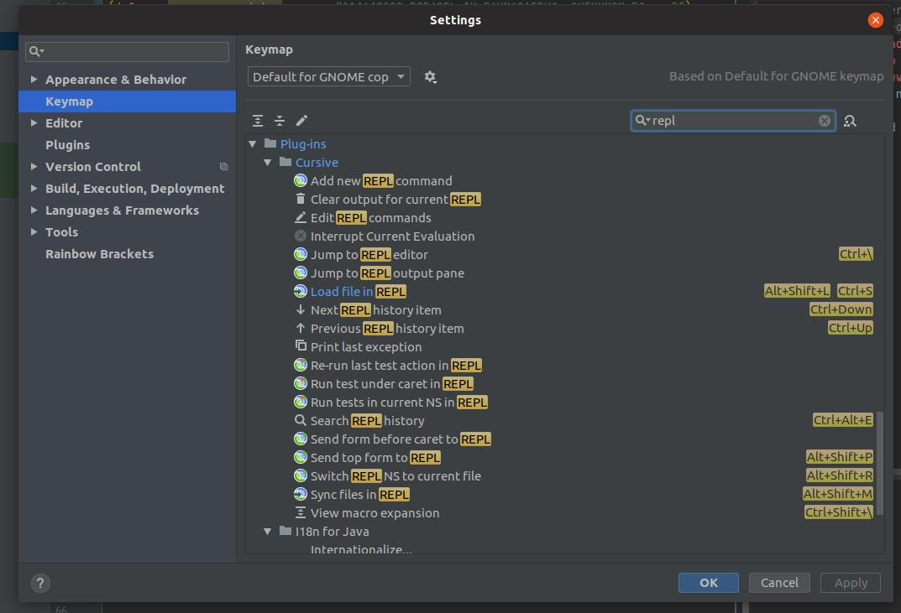

For Yan, who is like me started with clojure several times already and each time he had problems remembering how to setup Cursive properly.

> A lot of the best programmers and the most productive programmers I know are writing everything in Clojure and swearing by it, and then just producing ridiculously sophisticated things in a very short time. And that programmer productivity matters.
> [- Adrien Cockroft](https://thenewstack.io/the-new-stack-makers-adrian-cockcroft-on-sun-netflix-clojure-go-docker-and-more/)

1. Make sure you have <a href="https://leiningen.org/" target="_blank">leiningen</a> installed
   ```bash
   lein -v
   # Leiningen 2.8.3 on Java 1.8.0_191 Java HotSpot(TM) 64-Bit Server VM
   ```
1. go to <a href="https://www.jetbrains.com/" target="_blank">jetbrains</a> and download IntelliJ IDEA
1. install <a href="https://cursive-ide.com" target="_black">cursive plugin</a>
1. create new app
   ```bash
   lein new app sample-app
   ```
1. open it with IntelliJ
1. <a href="https://stackoverflow.com/questions/35091783/cant-delete-parenthesis-in-intellij-cursive">disable</a> structural editing. If you won't disable it then sometimes you won't be able to delete stuff. Stange? I know.
1. right click on `project.clj` -> `Run REPL for sample-app`. 
1. you will see the REPL on the right side, try to execute one or two simple commands there. 
1. the simplest flow is to type function definition, copy paste it to the REPL, execute and test it there 
1. there are several shortcuts which you can see if you right click on editor and then hover on `REPL` 
1. if you don't like default shortcuts you can override them in settings, for example assign to `CTRL + S` sending the whole file to the repl 
1. don't forget to install <a href="https://plugins.jetbrains.com/plugin/10080-rainbow-brackets">rainbow brackets</a> plugin to have a nice and useful syntax highlighting
